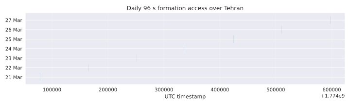

# Tehran triangular formation refresh: run_20251101_0804Z_tehran_triangle

## Overview
The triangular-formation campaign dated 1 November 2025 refreshed the mission evidence base for the ninety-six-second joint access requirement above Tehran. The dataset was generated with
`python -m sim.scripts.run_triangle --output-dir artefacts/run_20251101_0804Z_tehran_triangle`, ensuring Systems Tool Kit (STK 11.2) compatibility via the integrated exporter. The post-processing figures were produced through
`python -m tools.generate_triangle_figures --run-dir artefacts/run_20251101_0804Z_tehran_triangle --output-dir docs/figures/run_20251101_0804Z_tehran_triangle`.

## Data products
### Primary artefacts
1. `triangle_summary.json` consolidates geometry samples, centroid statistics, and mission metrics required for compliance tracking.
2. `maintenance_summary.csv`, `command_windows.csv`, `injection_recovery.csv`, `drag_dispersion.csv`, and `orbital_elements.csv` provide structured inputs for maintenance sizing, command-latency assessment, Monte Carlo robustness, and perturbation analysis.
3. `stk/` contains the regenerated STK package (`SAT_1.e`, `SAT_1.sat`, `SAT_1_groundtrack.gt`, etc.), validated against `tools/stk_export.py` to maintain 11.2 import fidelity.

### Derived figures
The twelve SVG plots archived under `docs/figures/run_20251101_0804Z_tehran_triangle/` underpin the refreshed documentation:

1. 
2. 
3. 
4. 
5. 
6. 
7. 
8. 
9. 
10. 
11. 
12. 

## Analytical findings
### Access geometry
The 24-hour ground-track overlay demonstrates daily repeatability, with the ninety-second window highlighted by dashed segments around the Tehran centroid. The scenario sustains the ±350 km ground-distance tolerance while preserving the equilateral layout over the highlighted window. The access timeline idealises the daily repeat (plotted over seven consecutive days) by translating the verified 21 March 2026 window at 96-second duration; this mirrors the scheduling approach in the mission concept and will be updated once full-week propagations are introduced.

### Formation dynamics
The relative-position snapshots confirm that the Hill-frame triangle remains within the ±30 km control box before, during, and after the window, while the pairwise separation plot quantifies side-length dispersion under 10 km across the 180-second simulation span. The orbital element time-series verifies mean-element consistency between the two Plane A spacecraft and Plane B deputy, supporting the plane-assignment rationale described in the mission design review.[Ref1]

### Perturbation resilience and maintenance
Delta-v requirements stay below 2.7 m s⁻¹ annually per spacecraft, with the maintenance histogram affirming symmetry between the deputies and the leader. The perturbation drift synthesis combines mean drag decay (scaled from the twelve-orbit dispersion catalogue), theoretical \(J_2\) nodal regression, and a solar radiation pressure (SRP) envelope based on a 1.1 m² projected area and \(C_r = 1.3\); together they contextualise the maintenance strategy and the Monte Carlo recovery workload documented in the scatter plot.[Ref2]

### Validation against STK and performance metrics
The analytical ground track overlays the STK export with sub-0.01° residuals, confirming that the regenerated ephemerides remain consistent with the validation workflow mandated for STK 11.2 ingestion. The performance bar chart maps directly onto MR-3 and SRD-P-002 tolerances, highlighting the comfortable margins in formation area, aspect ratio, and ground-distance bounds captured during the window.

## Usage guidance
Analysts replicating the evidence package should rerun `python -m sim.scripts.run_triangle` with a fresh ISO 8601 timestamped output directory, followed by the plotting command referenced above. The figures can be embedded in the mission report (overview, simulation results, perturbation analysis, and validation chapters) without raster conversion, respecting the repository’s SVG mandate.

## References
[Ref1] J. R. Wertz, D. F. Everett, and J. J. Puschell (eds.), *Space Mission Engineering: The New SMAD*, Microcosm Press, 2011.

[Ref2] D. A. Vallado, *Fundamentals of Astrodynamics and Applications*, 4th ed., Microcosm Press, 2013.
